# Maneren

Hi there!

I am a software engineering university student from the Czech Republic. I love
programming and living in the Linux terminal (Neovim rocks).

Nowadays, I code mostly in `Rust`, `C++` and `Python`, but also have experience
with `C`, `C#`, `Java`, `Haskell`, `Lua`, `Bash` and `JS/TS` for web development.

## Some stats for fun

